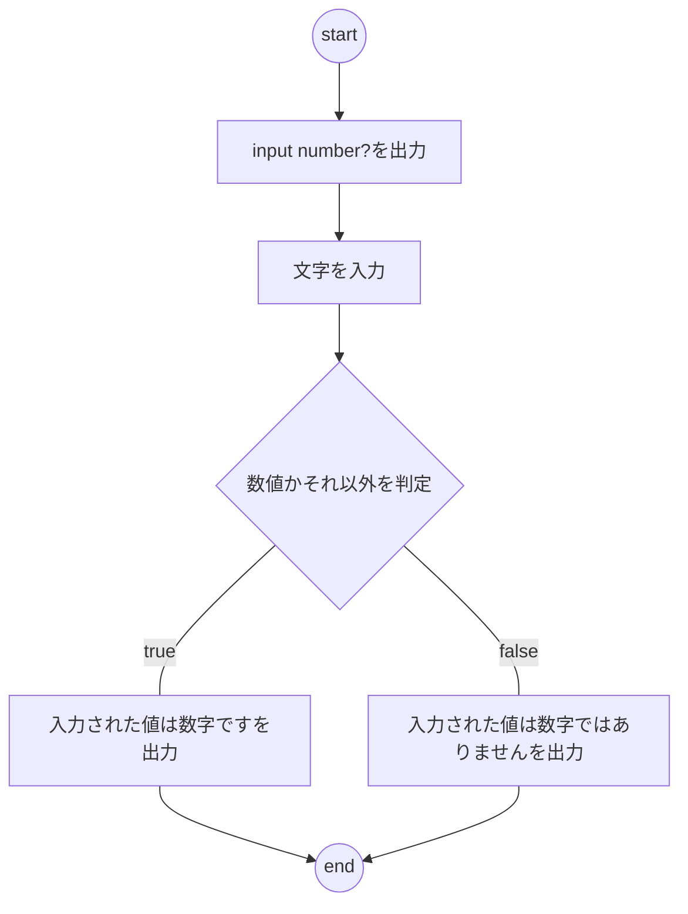

# yagami

# 001 数字にする
## ユーザーが入力した文字列を数字に変換する。ただし、ユーザーが入力した文字列が数字でない場合は、"数字ではありません"と表示する。

- input number?
  - 1
- 入力された値は数字です

- input number?
   - -10
- 入力された値は数字です

- inout number?
   - 12345678901234567890
- 入力された値は数字です

- input number?
    - 0.1
- 入力された値は数字です

- input number?
    - -100.05
- 入力された値は数字です

- input number?
    - 76512.6783456789
- 入力された値は数字です

- input number?
   - a
- 入力された値は数字ではありません

- input number?
   - !
- 入力された値は数字ではありません

- input number?
   - 
- 入力された値は数字ではありません

- input number?
   - 123 234
-  入力された値は数字ではありません

# flowchart

# todo
- 仕様を読む
- Eclipseを立ち上げる

- 実験用ソースファイルを作る
   - プロジェクト名　"sample"

- ソースファイルを作る
   - プロジェクト名　"todo"
   - パッケージ名　"day1"
   - ファイル名　"question001.java"
      - main class
      - メソッド　checkString()で文字列か数値化を判定（正規表現確認）

- 入力
    - "input number?"を出力する
      - System.out.println();
   - 数字（文字）をコンソールに入力する
      - BufferedReaderを作る
         - throws IOException
       - ReadLine()で変数str（String）に入力値を格納する

- 処理
    - strが数字であるかを判定する　checkString();
      - 変数result（boolean）を定義する
       - 初期値はfalse
    - 正規表現のパターンを設定する
      - Pattern pattern >> "^[0-9]+$"
    - 入力値strが正規表現に一致するかを判定する
      - Matcher matcher >> patternにstrが一致するかを判定
      - 確認した結果を変数resultに格納する
          - matcherの結果をresultに格納
              - 正規表現と一致>true
              - 正規表現と不一致>false

- 出力
   - 条件分岐
     - result == true
       - "入力された値は数字です"を出力する
         - System.out.println();
     - result == false
       - "入力された値は数字ではありません"を出力する
          - System.out.println();

- 動作確認
   - 全体を動かして確認
       - "1"を入力して確認
       - "100"を入力して確認
       - "12345678901234567890"を入力して確認
       - "a"を入力して確認
       - "!"を入力して確認
       - ""を入力して確認
       - "123 234"を入力して確認

